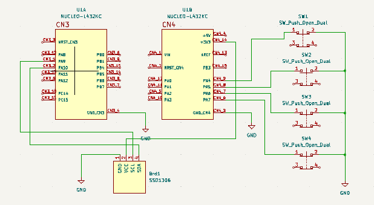
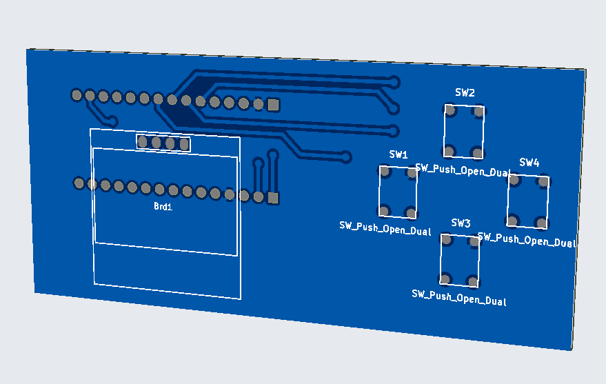

# Project Introduction
In this project, I presented my CV in a unique way to apply various embedded C tools.

## Project Objectives
The primary goal of this project was to showcase my skills in embedded C development, including the application of advanced techniques such as finite state machines and Xmacros.

#State Machine:

## Hardware Used
- **Microcontroller**: STM32L432 Nucleo Board [Link](https://www.st.com/en/evaluation-tools/nucleo-l432kc.html)
- **Display**: Kuman 0.96 Inch OLED [Link](https://www.amazon.fr/dp/B01N2K3BC9?psc=1&ref=ppx_yo2ov_dt_b_product_details)
- **OLED Drivers**: [GitHub Repository](https://github.com/afiskon/stm32-ssd1306)

I also had the opportunity to design a PCB for this project using KiCad:
## Schematic:  
  
## PCB 3D view:  

## Contact Information
If you would like to learn more about this project or get in touch with me, please feel free to do so through the following channels:
- [LinkedIn](https://www.linkedin.com/in/mohamed-taher-bazzazi-408395204/)
- Email: taher.bazzazi@ieee.org
